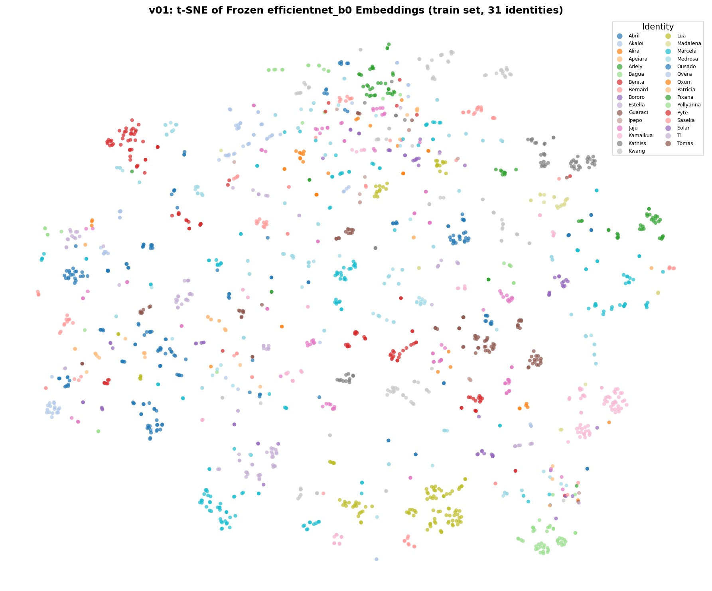

# Jaguar Re-Identification — Kaggle Competition

Matching individual jaguars across photographs using deep metric learning and computer vision.

**Competition**: [Jaguar Re-ID](https://www.kaggle.com/competitions/jaguar-re-id)
**Metric**: Identity-balanced Mean Average Precision (mAP)

## The Challenge

Given 1,895 training images of 31 named jaguars, predict pairwise similarity scores for 137,270 test image pairs. Each jaguar has unique spot patterns — the model must learn to distinguish individuals despite variations in viewpoint, lighting, and partial occlusion.

## Approach

We follow an iterative progression from simple to complex, benchmarking each step:

| Version | Approach | CV mAP | Status |
|---------|----------|--------|--------|
| v01 | Frozen EfficientNet-B0 + cosine similarity | 0.2781 | Done |
| v02 | Fine-tuned 31-class classifier embeddings | — | Planned |
| v03 | ArcFace / CosFace metric learning | — | Planned |
| v04 | Backbone exploration (EfficientNetV2, ConvNeXt, ViT) | — | Planned |
| v05 | Augmentation + Test-Time Augmentation | — | Planned |
| v06 | Hybrid: deep embeddings + engineered features → XGBoost/LightGBM | — | Planned |
| v07 | Ensemble + final optimization | — | Planned |

## Project Structure

```
├── notebooks/           # EDA, visualization, analysis (run locally)
├── kaggle_notebooks/    # GPU training notebooks (run on Kaggle)
├── src/                 # Reusable modules (data, models, losses, evaluation)
├── configs/             # Training configurations
├── figures/             # Plots and visualizations
├── results/             # Benchmark tables and metrics
└── submissions/         # Generated submission CSVs
```

## Key Results

**v01 — Frozen EfficientNet-B0 baseline (CV mAP: 0.2781)**
- ImageNet pretrained features, no fine-tuning, cosine similarity
- Best identity: Katniss (AP = 0.569) | Worst: Patricia (AP = 0.080)
- Establishes performance floor; confirms spot-pattern signal exists in ImageNet features




## Dataset

- **31 jaguars** with 13–183 training images each
- Images are background-removed cutouts (SAM3 preprocessing)
- Significant class imbalance — evaluation metric compensates via identity-balanced averaging
- Closed-set: all test identities appear in training

## Tech Stack

PyTorch, timm, torchvision, scikit-learn, XGBoost/LightGBM, matplotlib, UMAP

## Author

Alexy Louis
