# Jaguar Re-Identification — Kaggle Competition

Matching individual jaguars across photographs using deep metric learning and computer vision.

**Competition**: [Jaguar Re-ID](https://www.kaggle.com/competitions/jaguar-re-id)
**Metric**: Identity-balanced Mean Average Precision (mAP)

## The Challenge

Given 1,895 training images of 31 named jaguars, predict pairwise similarity scores for 137,270 test image pairs. Each jaguar has unique spot patterns — the model must learn to distinguish individuals despite variations in viewpoint, lighting, and partial occlusion.

## Approach

We follow an iterative progression from simple to complex, benchmarking each step:

| Version | Approach | CV mAP | Status |
|---------|----------|--------|--------|
| v01 | Frozen EfficientNet-B0 + cosine similarity | 0.2781 | Done |
| v02 | Fine-tuned 31-class classifier embeddings | 0.4821 | Done |
| v03 | ArcFace / CosFace metric learning | 0.6829 (full) | Done |
| v04 | Backbone exploration (EfficientNetV2, ConvNeXt, ViT) | 0.8382 (ConvNeXt full) | Done |
| v05 | Augmentation + Test-Time Augmentation | 0.8576 (full) | Done |
| v06 | Hybrid: deep embeddings + engineered features → XGBoost/LightGBM | 0.5104 (cosine) | Done |
| v07a | EVA-02 Large @448px, GeM, ArcFace, EMA, QE + rerank — 20 epochs | — | **LB 0.918** |
| v07b | EVA-02 Large @448px, seed=123, varied augmentation — 20 epochs | — | **LB 0.915** |
| v07f | DINOv2-Large-reg4 @448px, self-supervised pretraining — 15 epochs | — | **LB 0.886** |
| v07d | Pseudo-labeling: 3-model agreement filter + 5-epoch fine-tune | — | Running |
| v07e | 3-way average ensemble (EVA×2 + DINOv2) + DBA + reranking | — | Pending |

## Project Structure

```
├── notebooks/           # EDA, visualization, analysis (run locally)
├── kaggle_notebooks/    # GPU training notebooks (run on Kaggle)
├── src/                 # Reusable modules (data, models, losses, evaluation)
├── configs/             # Training configurations
├── figures/             # Plots and visualizations
├── results/             # Benchmark tables and metrics
└── submissions/         # Generated submission CSVs
```

## Key Results

**v07a/b/f — EVA-02 Large × 2 + DINOv2-Large-reg4 (LB 0.918 / 0.915 / 0.886)**
- Switched from ConvNeXt-Small to **EVA-02 Large** (300M params, patch14 @ 448px) — massive representation quality jump
- Added **GeM pooling** (learnable p=3) → upweights high-activation (distinctive spot) regions over global average pooling
- Added **EMA** (decay=0.999) — shadow copy of weights produces smoother inference model
- Added **gradient checkpointing** — trades 30% compute for 40% VRAM savings at 448px
- Post-processing: flip TTA + **query expansion** (top-3) + **k-reciprocal reranking** (k1=15, λ=0.4)
- 20 epochs vs 10: 0.849 → **0.918** (+0.069) for v07a — significant convergence gain
- **DINOv2-Large-reg4** added as 3rd model: self-supervised pretraining (DINO+iBOT on LVD-142M) creates fundamentally different features from EVA-02's supervised training → genuine ensemble diversity at same 1024-dim → clean 3-way average (no cross-arch concat noise)
- Ensemble lesson: cross-arch concat (EVA 1024d + ConvNeXt 1536d) regressed results (0.918→0.902); same-dim averaging is the correct fusion strategy
- Phase 2 running: pseudo-labeling (3-way agreement filter) + final 3-model ensemble targeting 0.95+

**v06 — Hybrid LightGBM (cosine val mAP: 0.5104, full mAP: 0.8603)**
- ConvNeXt-Small + ArcFace with **light** augmentation (reverted from v05 heavy aug)
- Light aug model improves cosine val mAP: 0.5046 (v04) → 0.5104 (+0.006)
- LightGBM on 571-dim pairwise features (cosine, L2, |emb_i−emb_j|, colour histogram diffs)
- Result: LightGBM (0.4908) < cosine (0.5104) — ArcFace embeddings already encode optimal similarity
- LightGBM early-stopped at 100 iterations — no additional structure beyond cosine found
- Key insight: for closed-set re-ID with well-trained ArcFace, cosine is the optimal pairwise measure

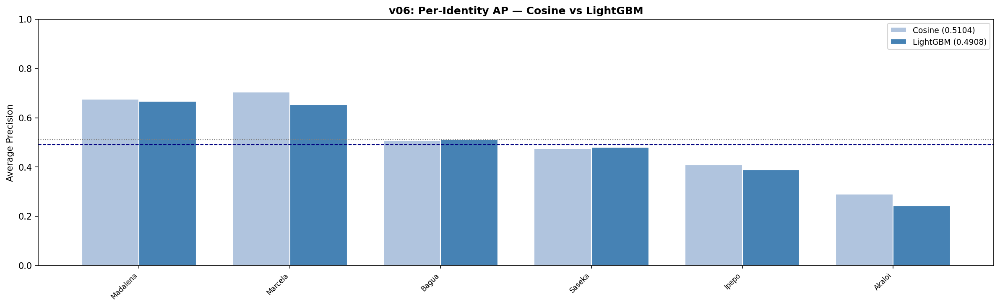
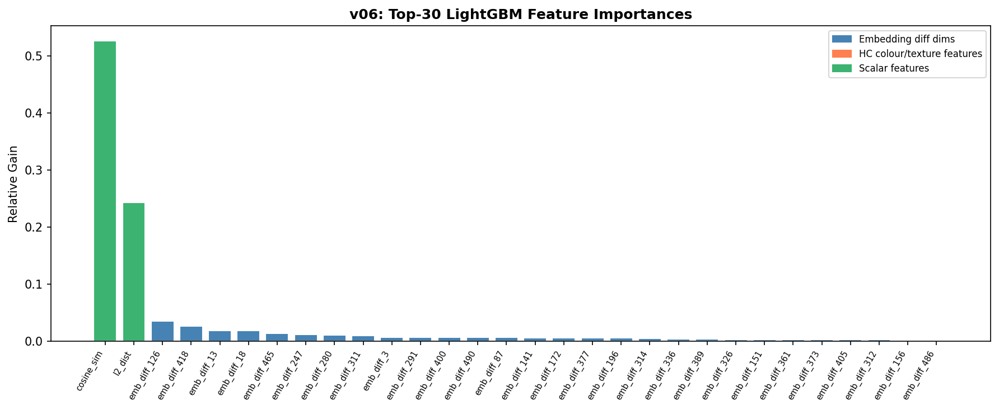

**v05 — Heavy augmentation + 5-view TTA (full mAP: 0.8576)**
- ConvNeXt-Small + heavy aug: RandomRotation(10°), aggressive ColorJitter, RandomErasing(p=0.25)
- 5-view TTA: centre crop, hflip, top-left, top-right, bottom-centre crops → averaged embeddings
- TTA boost: val mAP 0.4848 → 0.4916 (+0.007) | Full train mAP: 0.8576 (+0.019 over v04)
- Leaderboard: **0.795** (marginal regression vs v04 0.797) | Best: Marcela | Worst: Akaloi
- Heavy aug may slightly over-regularise for this small dataset (1,895 images)

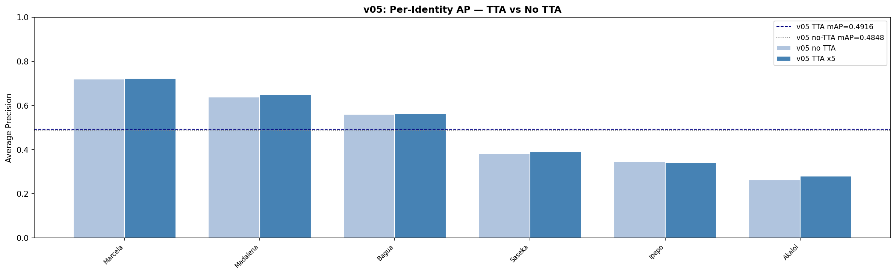
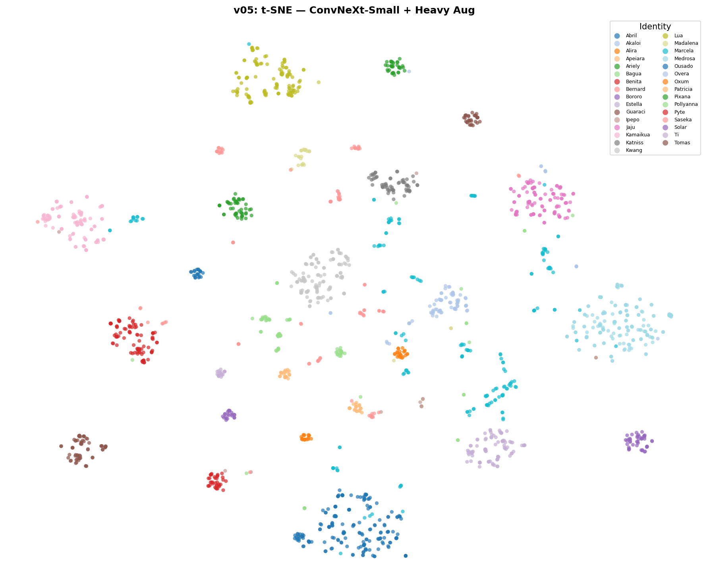

**v04 — Backbone search: ConvNeXt-Small wins (full mAP: 0.8382)**
- Compared tf_efficientnetv2_s (0.689), convnext_small (0.838), vit_small_patch16_224 (0.562)
- All use same ArcFace(m=0.5, s=30) + 512-dim projection + image caching + AMP
- Leaderboard: 0.797 (+32% over v03) | Best: Estella | Worst: Saseka
- Total training time: 23 min for 3 backbones (vs expected ~25h without caching)

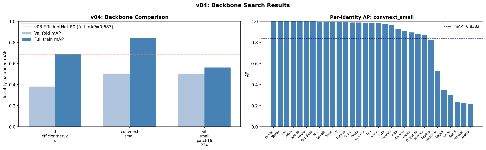

**v03 — ArcFace metric learning (CV mAP: 0.6829 full train / 0.4431 val fold)**
- EfficientNet-B0 + projection 1280→512 (Linear+BN) + ArcFace(m=0.5, s=30)
- Two-stage: 5 epochs head-only + 30 epochs full fine-tune | backbone lr=1e-5, head lr=1e-3
- Leaderboard: 0.609 (+47% over v02) | Best: Lua | Worst: Ipepo

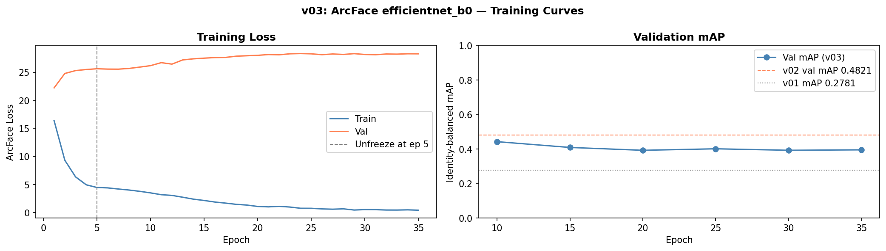
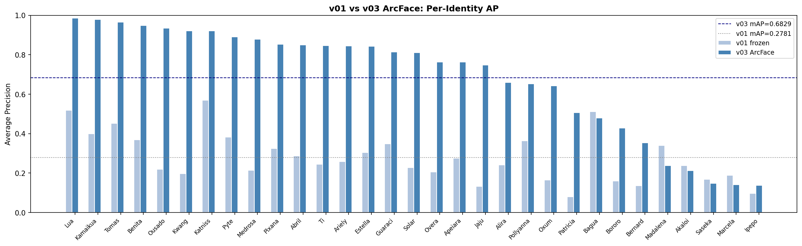
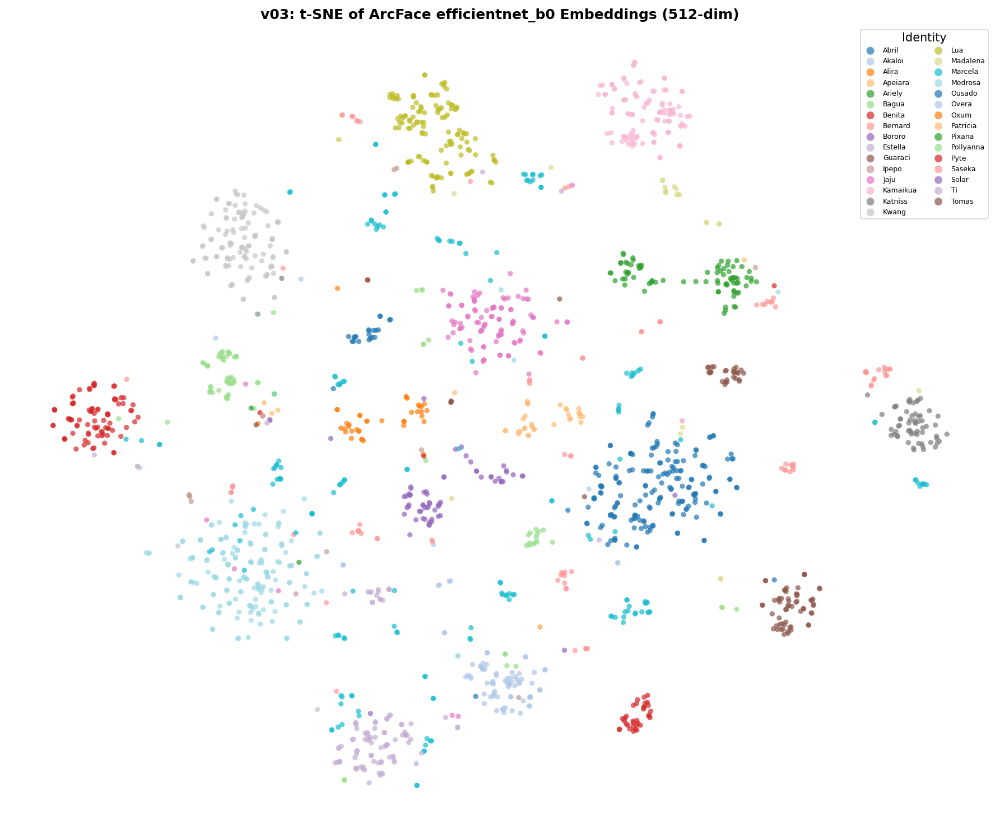

**v02 — Fine-tuned 31-class classifier (CV mAP: 0.4821 val / 0.5258 full train)**
- Two-stage fine-tuning: 5 epochs head-only + 25 epochs full fine-tune
- Differential LR: backbone 1e-4, head 1e-3 | CrossEntropy with label_smoothing=0.1
- Leaderboard: 0.414 | Best identity: Tomas | Worst: Saseka
- +73% improvement over frozen baseline

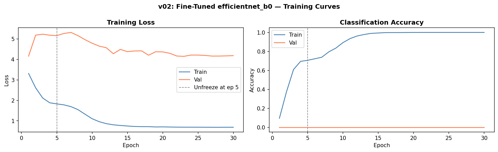
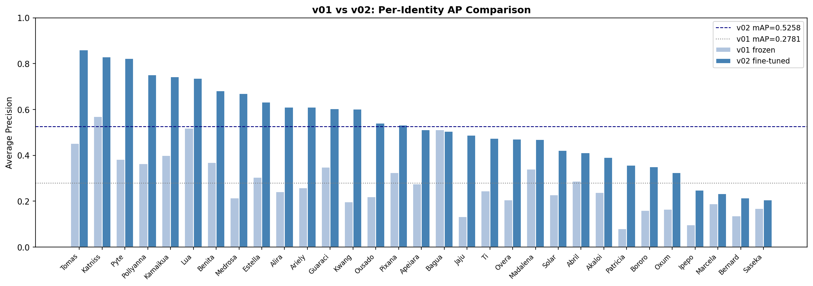
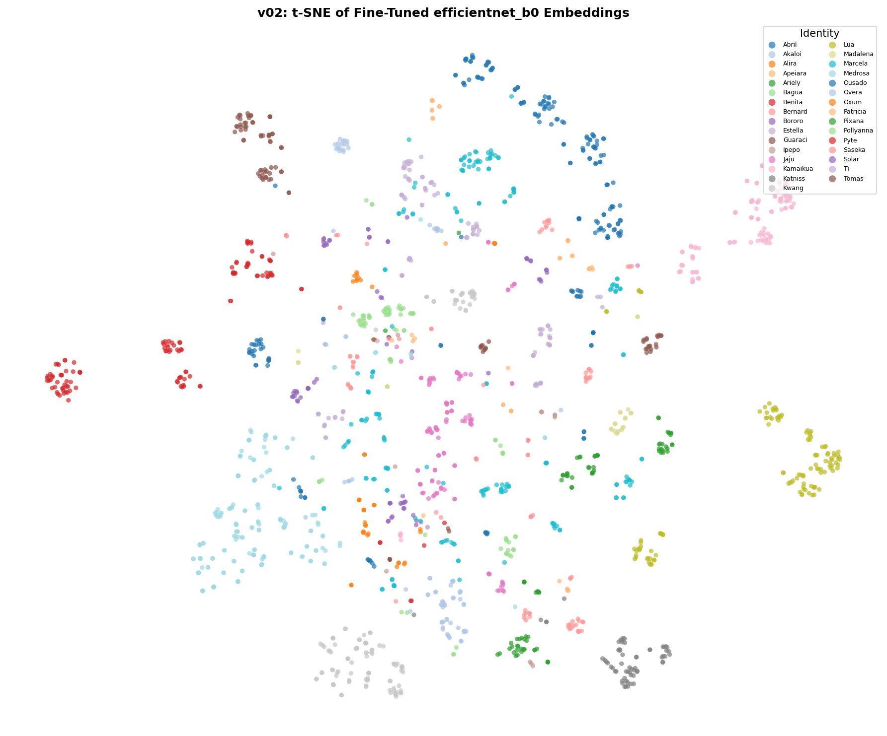

**v01 — Frozen EfficientNet-B0 baseline (CV mAP: 0.2781)**
- ImageNet pretrained features, no fine-tuning, cosine similarity
- Best identity: Katniss (AP = 0.569) | Worst: Patricia (AP = 0.080)
- Establishes performance floor; confirms spot-pattern signal exists in ImageNet features

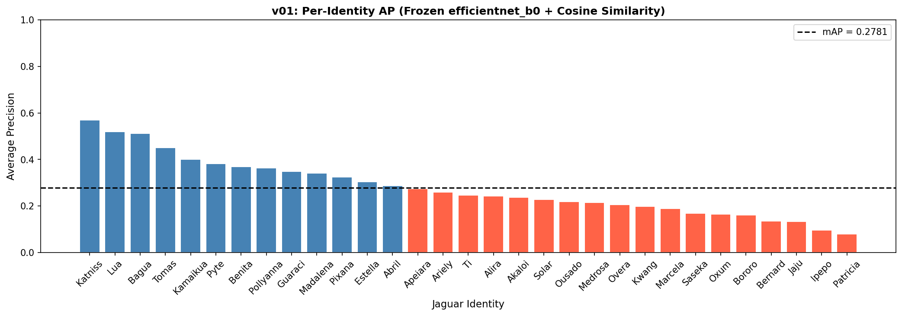
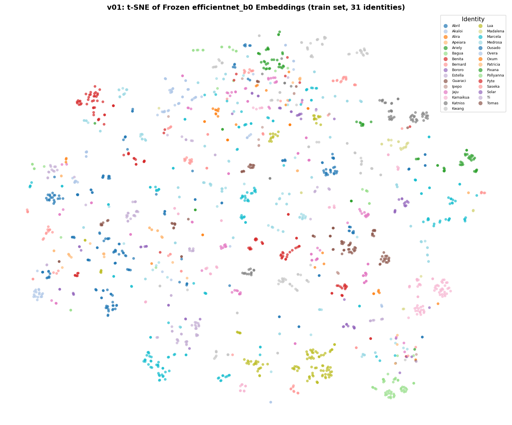

## Dataset

- **31 jaguars** with 13–183 training images each
- Images are background-removed cutouts (SAM3 preprocessing)
- Significant class imbalance — evaluation metric compensates via identity-balanced averaging
- Closed-set: all test identities appear in training

## Tech Stack

PyTorch, timm, torchvision, scikit-learn, XGBoost/LightGBM, matplotlib, UMAP

## Author

Alexy Louis
