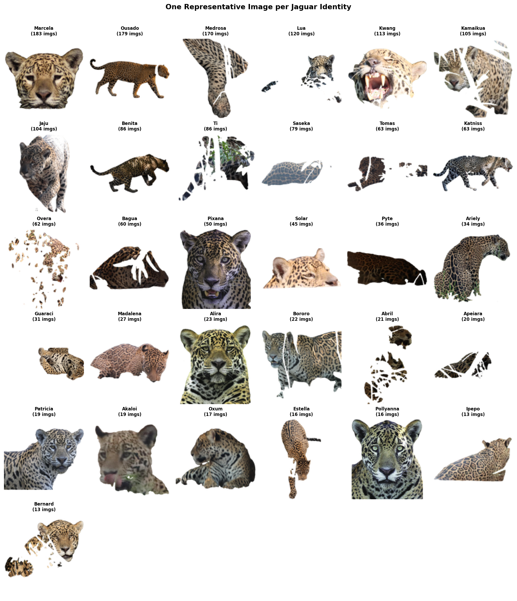
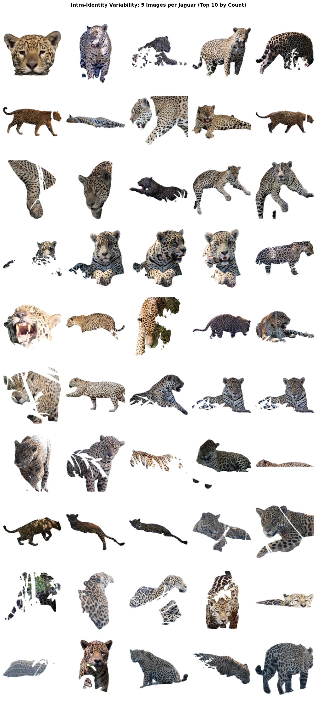
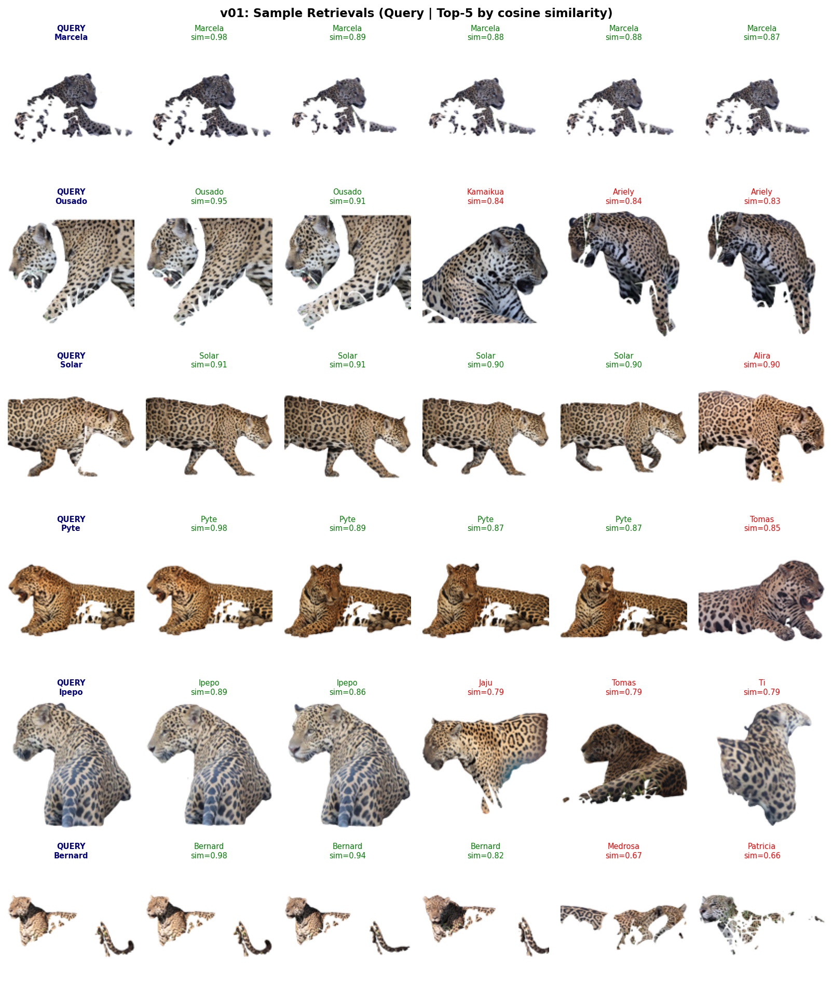

# Jaguar Re-Identification — 4th Place Solution

**Competition**: [Jaguar Re-ID](https://www.kaggle.com/competitions/jaguar-re-id) · **Final rank: 4th / 348 teams** · **Private LB: 0.939**

Matching individual jaguars across photographs using deep metric learning. Given 1,895 training images of 31 named jaguars, predict pairwise similarity scores for 137,270 test image pairs.

---

## The jaguars



31 individuals, each with a unique spot pattern. Image counts range from 13 (Bernard, Ipepo) to 183 (Marcela). The evaluation metric is identity-balanced mAP — each jaguar contributes equally regardless of how many images they have.

### Why this is hard



The same jaguar looks completely different depending on viewpoint, pose, and lighting. Meanwhile, different jaguars can look superficially similar if their spot patterns overlap in the frame. The model must learn to distinguish individuals, not just "jaguar vs not jaguar".

### The task



*Sample retrievals from the v01 frozen baseline — even ImageNet features partially work. Green = correct identity, red = wrong.*

---

## Results

| Version | Approach | Private LB | Public LB |
|---------|----------|-----------|----------|
| v01 | Frozen EfficientNet-B0 + cosine similarity | ~0.28 | — |
| v02 | Fine-tuned 31-class classifier | 0.414 | — |
| v03 | ArcFace metric learning | 0.609 | — |
| v04 | Backbone search → ConvNeXt-Small wins | 0.797 | — |
| v05 | Heavy augmentation + 5-view TTA | 0.795 | — |
| v06 | Hybrid: ArcFace embeddings + LightGBM | 0.799 | — |
| v07a | EVA-02 Large @ 448px, 20 epochs, seed=42 | 0.918 | 0.934 |
| v07b | EVA-02 Large @ 448px, 20 epochs, seed=123 | 0.915 | 0.901 |
| v07f | DINOv2-Large-reg4 @ 448px, 15 epochs | 0.886 | 0.878 |
| v07d | Pseudo-labeling (3-model agreement) | 0.935 | 0.933 |
| **v07e** | **3-model ensemble + QE + reranking** | **0.939** ✓ | **0.964** |
| v07g | Round-2 pseudo-labeling | 0.937 | 0.954 |

---

## Approach

A systematic progression: start simple, benchmark everything, scale what works.

The final pipeline combines three large ViT models (EVA-02 Large × 2 + DINOv2-Large) trained with ArcFace metric learning, pseudo-labeled on test images, and ensembled with query expansion and k-reciprocal reranking. Full details in [SOLUTION.md](SOLUTION.md).

### Key milestones

**ArcFace over CrossEntropy (+47%)**: Training as a retrieval task directly — adding an angular margin penalty that forces embeddings of the same identity to cluster tightly — dramatically outperforms treating it as a 31-class classification problem.

**EVA-02 Large @ 448px (+15%)**: The biggest single jump. At 448px with 14px patches, each ViT token covers a ~14×14px region — roughly the scale of jaguar spots. The model's attention can resolve individual spot details rather than blurred regions.

**GeM pooling**: Instead of average pooling the ViT tokens, Generalised Mean Pooling (learnable p≈3) upweights the most discriminative spatial regions — the distinctive spot pattern areas dominate the embedding rather than uniform background.

**EMA inference**: A shadow copy of model weights maintained as a running average over training. Smoother than the final raw checkpoint and consistently improves retrieval mAP by ~0.5–1%.

**Pseudo-labeling**: Used all three trained models to label test images — only images where all three agreed with confidence > 0.90 were added to training (~100–150 samples). Conservative but high-precision: adds test-domain information without introducing label noise.

**3-way ensemble**: Simple average of L2-normalised embeddings from EVA-A, EVA-B, and DINOv2 (all 1024-dim). EVA-02 is supervised (ImageNet-21k), DINOv2 is self-supervised (DINO+iBOT on LVD-142M) — different pretraining paradigms produce genuinely diverse features. Averaging in the same embedding space is clean; concatenation across architectures hurt results.

**K-reciprocal reranking**: Post-processing from Zhong et al. 2017. If A is in B's top-k and B is in A's top-k, they're reciprocal neighbours — likely the same individual. Blending Jaccard similarity over these sets with cosine similarity (k1=20, λ=0.3) added ~0.01–0.02 LB at every stage.

---

## Project structure

```
├── kaggle_notebooks/    # GPU training notebooks (v01–v07g)
├── notebooks/           # EDA and local analysis
├── src/                 # Reusable modules (data, models, losses, evaluation)
├── figures/             # Plots and visualisations
├── results/             # Benchmark tables (benchmarks.csv)
├── submissions/         # Generated submission CSVs
└── SOLUTION.md          # Full competition writeup
```

## Tech stack

**Core**: PyTorch, timm, torchvision
**Backbone models**: EVA-02 Large (`eva02_large_patch14_448`), DINOv2-Large-reg4 (`vit_large_patch14_reg4_dinov2.lvd142m`)
**Metric learning**: ArcFace (s=30, m=0.5), GeM pooling, BN embedding head, EMA
**Post-processing**: Query expansion (DBA, top-3), k-reciprocal reranking (Zhong et al. 2017)
**Feature baselines**: XGBoost, LightGBM, scikit-learn
**Visualisation**: matplotlib, seaborn, UMAP
**Training infrastructure**: Kaggle P100/T4 (16GB), AMP, gradient checkpointing

---

## Author

Alexy Louis — [GitHub](https://github.com/Smooth-Cactus0)

Most notebooks in this project were built with [Claude Sonnet 4.6](https://www.anthropic.com/claude).
